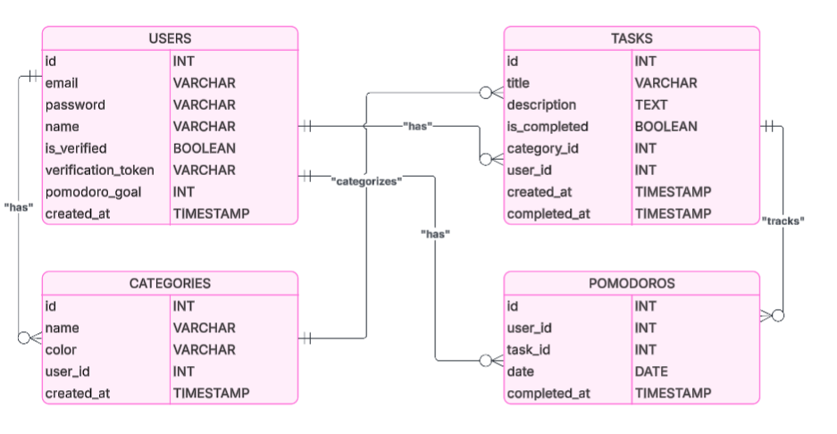
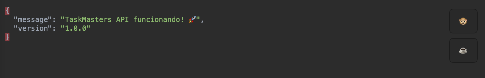
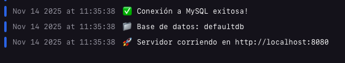

# TaskMasters - Backend

API REST para la aplicación de tareas con técnica Pomodoro.
URL: https://backend-taskmasters-production.up.railway.app

## 📸 Capturas de Pantalla

### Base de Datos MySQL

*Estructura de la base de datos mostrando las tablas principales: usuarios, tareas, categorías y pomodoros con sus relaciones*

### API en Funcionamiento

*Pruebas de endpoints de la API mostrando respuestas exitosas de autenticación y gestión de tareas*

### Logs del Servidor

*Logs del servidor en Railway mostrando requests procesados y estado saludable de la aplicación*

## 🚀 Características

- **Autenticación JWT** - Sistema seguro de login y registro
- **Gestión de Tareas** - CRUD completo con categorías
- **Técnica Pomodoro** - Seguimiento de ciclos de productividad
- **Categorías** - Organización personalizada de tareas
- **Estadísticas** - Métricas de productividad

## 🛠️ Tecnologías

- **Node.js** con Express.js
- **MySQL** como base de datos
- **JWT** para autenticación
- **bcryptjs** para encriptación de contraseñas
- **express-validator** para validaciones

## 📦 Instalación

```bash
# Clonar el repositorio
git clone https://github.com/martinbasile13/BackEnd-TaskMasters.git
cd BackEnd-TaskMasters

# Instalar dependencias
npm install

# Configurar variables de entorno
cp .env.example .env
# Editar .env con tus credenciales

# Iniciar el servidor
npm start
```

## ⚙️ Variables de Entorno

```env
DB_HOST=localhost
DB_USER=tu_usuario
DB_PASSWORD=tu_contraseña
DB_NAME=taskmaster_db
JWT_SECRET=tu_jwt_secret_super_seguro
PORT=3000
```

## �🔗 API Endpoints

### Autenticación
- `POST /api/auth/register` - Registrar usuario
- `POST /api/auth/login` - Iniciar sesión
- `GET /api/auth/profile` - Obtener perfil

### Tareas
- `GET /api/tasks` - Listar tareas
- `POST /api/tasks` - Crear tarea
- `PUT /api/tasks/:id` - Actualizar tarea
- `PATCH /api/tasks/:id/toggle` - Cambiar estado
- `DELETE /api/tasks/:id` - Eliminar tarea

### Categorías
- `GET /api/categories` - Listar categorías
- `POST /api/categories` - Crear categoría
- `PUT /api/categories/:id` - Actualizar categoría
- `DELETE /api/categories/:id` - Eliminar categoría

### Pomodoros
- `GET /api/pomodoros/today` - Pomodoros del día
- `POST /api/pomodoros` - Registrar pomodoro
- `GET /api/pomodoros/stats` - Estadísticas

## 🚀 Ver el proyecto en vivo

- **Frontend**: [(https://front-end-task-masters.vercel.app/login)]
- **Backend**: [(https://backend-taskmasters-production.up.railway.app)]


## 🤝 Contribuir

1. Fork el proyecto
2. Crear una rama (`git checkout -b feature/nueva-funcionalidad`)
3. Commit los cambios (`git commit -am 'Agregar nueva funcionalidad'`)
4. Push a la rama (`git push origin feature/nueva-funcionalidad`)
5. Crear un Pull Request

## 💬 Contacto

Si tenés alguna pregunta sobre el proyecto o querés saber más sobre la implementación, no dudes en contactarme.

**Desarrollado con ❤️ para la UTN** 🎓
